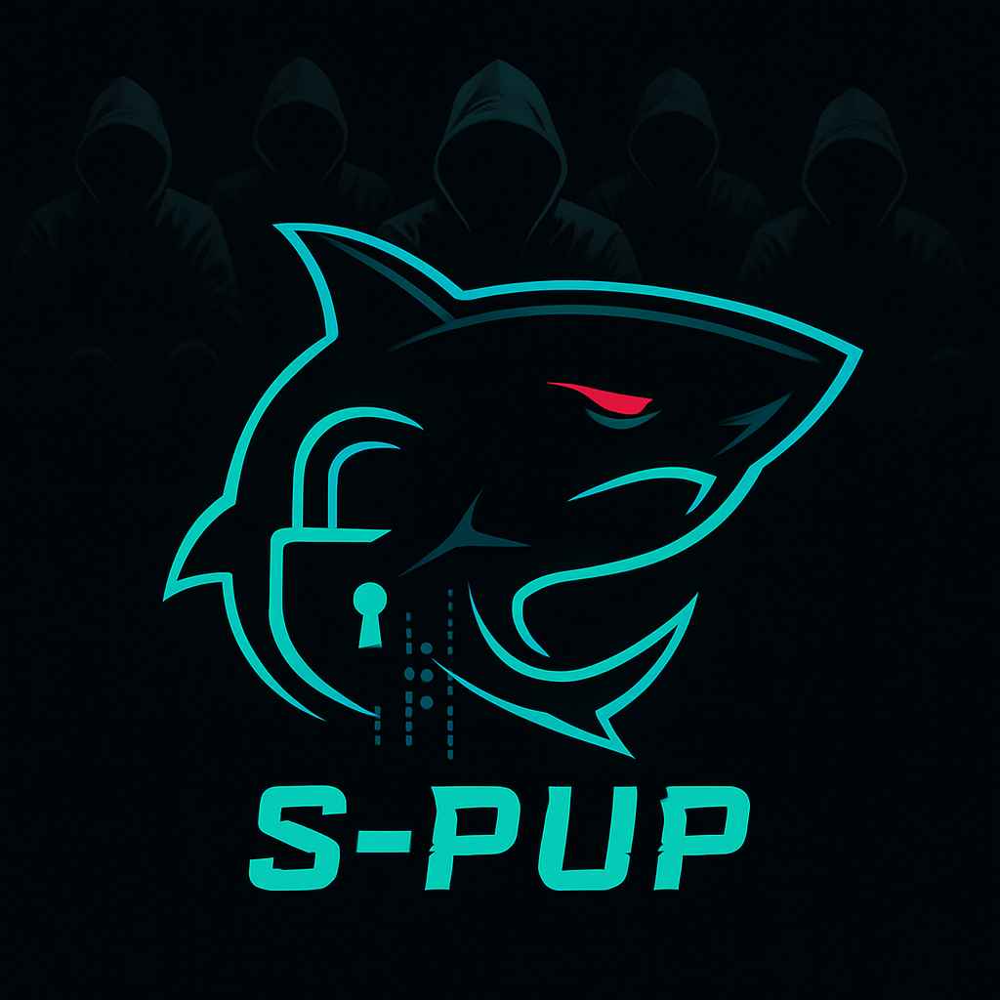

# 🦈 S-PUP (SHARK PUP)




**By Anas Labrini**  
_"From nothing we make everything."_

---

## 📜 Overview

**S-PUP (SHARK PUP)** is an advanced surveillance and persistence Python-based tool designed for **red team** operations, combining powerful keylogging, system reconnaissance, stealth, and dynamic encryption mechanisms. It includes both encryption utilities and a full persistence-enabled logger that can also perform system information harvesting and evade analysis.

---

## 📁 Project Structure

```
S-PUP/
├── en.py              # AES encryptor with self-rebuilding script capabilities
├── windows.vbs        # VBS-Python Loader is a stealthy dropper script written in VBScript and PowerShell
└── tool/
    └── S-PUP.py        # Main keylogger and persistence tool
```

---

## 🔐 `en.py` - AES Encryptor

### 🔧 Features
- Encrypts any Python script using AES (CBC mode) with a dynamically generated key.
- Creates a self-decrypting script (`S-PUP_AES.py`).
- Option to convert the final encrypted script into a `.exe` using PyInstaller.
- Uses system details (hostname, OS, CPU) to generate encryption key.
- For example, guards monitor their leader, and if they can't find him or he dies, one of the guards takes over and revives him.

---

## 🐍 VBS-Python Loader
`VBS-Python Loader` is a stealthy dropper script written in VBScript and PowerShell, designed for red teaming, penetration testing, and advanced malware simulation. This loader simulates how real-world adversaries silently deliver Python-based payloads on Windows machines without triggering security alerts.

## 🚀 Features

 - **Silent Execution:** Executes PowerShell scripts in hidden mode with `ExecutionPolicy Bypass`.
 - **Embedded Python Deployment:** Automatically detects system architecture and downloads the appropriate **portable embedded Python 3.11** environment (no installation required).
 - **Library Injection:** Installs critical Python libraries (`requests`, `pynput`, `psutil`) silently.
 - **Remote Payload Fetching:** Downloads an external Python script (keylogger or any custom logic) from a remote server.
 - **Auto Execution:** Launches the Python payload immediately after environment setup.
 - **Self-Cleanup:** Deletes all temporary files and the loader script after successful execution, leaving minimal traces.

## 🧬 Technical Workflow

1. VBScript generates and writes a PowerShell loader to `%TEMP%`.
2. PowerShell script:
   - Creates Python install path.
   - Downloads & extracts embedded Python.
   - Installs required libraries.
   - Fetches and executes the Python payload.
3. Script removes itself to avoid forensic discovery.

## 📁 File Structure

```
📄 loader.vbs          → The main VBS dropper
📁 %TEMP%
 ┣ 📄 loader.ps1       → Generated PowerShell loader
 ┗ 📄 cleanup.vbs      → Self-deletion script

```

### ▶️ Usage
```bash
python3 en.py
```
You will be prompted to enter the path to the target Python script.

---

## 🧠 `S-PUP.py` - Surveillance & Persistence

### 🎯 Capabilities
- **Keylogger**: Logs keystrokes in real-time and sends logs via email.
- **Email Integration**: Sends logs, system details, and browser credential files.
- **System Reconnaissance**:
  - OS version, architecture, user info
  - Internal/external IP, MAC address
  - Installed programs, active processes
  - Desktop/Downloads file listing
  - Wi-Fi networks (Linux)
- **Browser Data**:
  - Copies Chrome and Firefox login/password files
- **Stealth & Evasion**:
  - Anti-debugging & anti-analysis (kills tools like Wireshark, GDB, etc.)
  - Deletes known reverse engineering tools if permissions allow
- **Persistence**:
  - Auto-start via systemd on Linux, Startup folder on Windows, and LaunchAgent on macOS
  - Creates multiple hidden backups
  - Watchdog mode to restore if main script is deleted
- **Self-Updating**:
  - Auto-checks GitHub for updates hourly

### ▶️ Usage
```bash
python3 S-PUP.py
```

> On first run, it installs itself as a persistent background service depending on the OS.

---

## ⚙️ Configuration

Edit the following in `S-PUP.py`:
```python
EMAIL_ADDRESS = "default_email"
EMAIL_PASSWORD = "default_password"
TO_EMAIL = "default_receiver"
```

Update the GitHub auto-update link:
```python
update_url = "https://raw.githubusercontent.com/anaslabrini/S-PUP/refs/heads/main/tool/S-PUP.py"
```

---

## 🛡 Anti-Analysis Features

- Process scan and kill:
  - e.g., `wireshark`, `gdb`, `IDA`, `ghidra`, `sandboxie`, `vboxservice`, `frida`
- Deletes apps from known paths if permissions allow

---

## 📤 Email Report Example

- `keylogs_TIMESTAMP.txt` with recorded keystrokes
- System info report body
- Attached files from browser paths (Login Data, logins.json, etc.)

---

## 🚀 Persistence Details

| OS        | Method                      |
|-----------|-----------------------------|
| **Linux** | `systemd --user` service    |
| **Windows** | Startup `.bat` file       |
| **macOS** | `LaunchAgent` plist         |

Backups are created in:
- `~/.config/.cache/`
- `~/.local/share/.logs/`
- etc.

---

## 🧪 Watcher Mode

If the main script is deleted, the watchers upgrade themselves to the base system and restore service.

### Run Watcher:
```bash
python3 S-PUP.py --watcher
```

---

## 🧩 Dependencies

- `pynput`
- `psutil`
- `smtplib`
- `requests`
- `pycryptodome`
- `PyInstaller` (optional)

Install with:
```bash
pip install pynput psutil requests pycryptodome
```
---

## 📜 A detailed report from Lisan Anas Labrini

**S-PUP** is an advanced, sophisticated, and intelligent malware developed by Anas Labrini. When the malware enters a system, whether Linux, Windows, or Mac OS, it spreads through five hidden paths that are difficult for the average user or even someone with average experience to access. After spreading, it installs itself in the autorun path when the system restarts, ensuring that the malware runs when the system boots. Each time the system boots, a notification is sent to an email or Telegram bot. The notification contains information about the system, such as system information: device name, system type, system version, processor type, number of cores, architecture, space, and current user. It also collects network information, such as: local and external IP addresses, MAC addresses, the name of the connected Wi-Fi network, the network interface and associated IPs, open TCP/UDP connections via netstat, devices connected to the same network, and information about files and applications, such as: a list of files in Desktop, Downloads, and Documents; a list of all installed programs on the system; and sensitive paths such as .ssh and AppData. Etc.
Also, passwords and stored information, such as extracting passwords from Chrome, Firefox, and Wi-Fi passwords. After all this, it checks the system to see if it contains advanced protection programs or digital forensics programs, for example, Wireshark, Process Hacker, IDA Pro, Frida, GDB, and stops the processes associated with them or makes them not work silently without raising suspicion, and if necessary, deletes them from the system. Then it starts recording keystrokes every 50 clicks. The information is sent to an email or a Telegram bot. Now we are talking about Persistence. It creates 5 copies whose role is to monitor it. If the program is stopped or deleted, it is immediately restored. These five are in different hidden paths, and each one of them monitors the program. For example, there is a leader and five guards. If the leader falls, the leadership is taken over by one of the guards to replace the leader and revive or operate him. This means that it is difficult to delete him because the guards monitor the leader every 60 minutes to see if he is working or present. In addition to the automatic update, it updates itself every 60 minutes from the warehouse and makes sure there is any update, and if it finds an update, it replaces itself. This allows us to install a backdoor and gain remote control, meaning the ability to expand the scope of the attack.
Here, we touch on an important point: the software runs on systems in py format, making it undetectable and difficult to monitor its activity during the download process. This solves the protection by setting up portable python for each system type, so that it comes with a modern Python environment with the libraries required by the software. This avoids problems such as Python not being properly configured on the system. For example, if we want to target Windows, we develop a script in vbs format that creates a PowerShell script and runs it silently, without interruptions or interference. It checks the system type to download the appropriate portable python. The software is then downloaded and executed. Once executed, the script confirms that the software has run successfully and that the guards are in place. It removes itself from the system, all in complete silence.
Currently, the software is still receiving updates. I will add several highly advanced features and technologies in the future to make it a true copy of **Pegasus**.
**Anas Labrini**

---

## ⚖️ License

This project is licensed under the **Red Team Research License (RTR-License)**.

You are permitted to:
- Use, modify, and extend this tool **for educational purposes, ethical hacking, and Red Team simulation, provided you acknowledge the source**.
- Share the code with credit to the original author.

You are strictly prohibited from:
- Use this tool for any illegal activity, real-world surveillance, or unauthorized access to systems.
- Sell or distribute this tool for malicious purposes.

Any violation of these terms voids the license and gives the author the right to take legal action or publicly disclose any misuse.

---

## ⚠️ Legal Disclaimer

> ⚠ **WARNING: FOR AUTHORIZED USE ONLY**

This software is provided exclusively for the following purposes:
- **Educational Purposes**
- **Cybersecurity Research**
- **Forcing recruitment and penetration testing on systems you own or expressly authorize**

**Unauthorized dissemination**, use against third-party infrastructure, espionage, or malicious espionage:
- Is a **criminal offense**
- Reported to the relevant authorities
- May result in **serious legal consequences**

The author (**Anas Labrini**) assumes **no responsibility** for any misuse, damages, or legal claims arising from the use of this tool.

**You have been warned.**

This tool is intended exclusively for **educational** and **forcing** authorized purposes.
**Unauthorized use is illegal.** The author is not responsible for misuse. ---

## 🧠 Author

**Anas Labrini**  
18 years old | Red Team Cybersecurity Researcher  
Salé, Morocco 🇲🇦  
GitHub: [anaslabrini](https://github.com/anaslabrini)
Instagram: [anasans005](https://www.instagram.com/anasans005?igsh=dzNsOXN3Nm9INmVk)
WebSite: [anaslabrini](https://anaslabrini.netlify.app)

