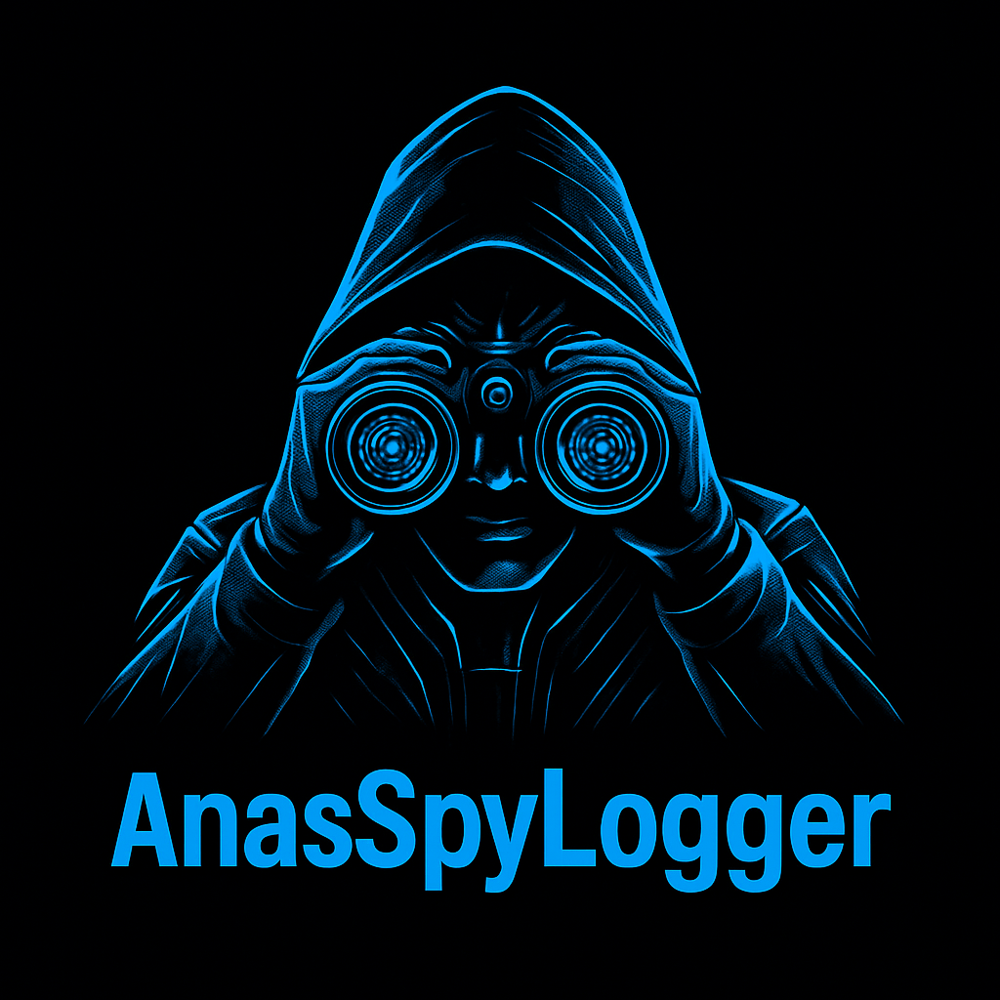

# AnasSpyLogger



AnasSpyLogger is an advanced keylogger tool developed by **Anas Labrini**. This tool is designed for tracking keypresses on the target system, capturing sensitive information, and sending logs via email. It also includes persistence features to ensure the keylogger runs on system startup, as well as the ability to update itself from a remote server. 
Developed with love in Python ❤ by [anasslabrini](https://github.com/anasslabrini).
MyWebSite: [anaslabrini](https://anaslabrini.netlify.app)
Instagram: [anasans005](https://www.instagram.com/anasans005?igsh=dzNsOXN3Nm9INmVk)

This tool is intended for educational and ethical testing purposes only. Use responsibly and only on systems you have explicit permission to test.

## Features

- **Keylogging:** Capture keystrokes in real-time.
- **Email Reporting:** Send captured logs to a specified email address.
- **Persistence:** Automatically starts when the system reboots.
- **Auto-Update:** Automatically checks and updates the script from a remote server.
- **Cross-Platform:** Works on Linux, Windows, and macOS systems.

## Requirements

- Python 3.x
- `pynput` for keyboard event listening
- `requests` for script updates
- `smtplib` for sending emails
- `subprocess` and `platform` for system-specific persistence mechanisms

### Install Dependencies

Before running AnasSpyLogger, you need to install the necessary Python libraries:

```bash
pip install pynput requests
```

## Usage

### Step 1: Setup Configuration
Before running the keylogger, you need to configure it by providing the following details:

- **Email Address:** Your email address for sending the captured keystrokes.
- **Email Password:** Password application for your email address.
- **Receiver Email:** The email address to which the logs will be sent.
- **Output Filename:** The name of the output Python file for logging the keystrokes.

The configuration is done via a prompt when running the `main.py` script. It will ask you to provide the above details.

### Step 2: Run the Keylogger

After configuring the email settings, simply run the `main.py` script:

```bash
python main.py
```

This will:
- Prompt for your email, password, receiver email, and output filename.
- Start logging keystrokes.
- Send the logs to the receiver's email.
- Ensure the script persists and runs automatically upon system reboot.


## File Structure

```
AnasSpyLogger/
│
├── main.py                  # Main script to run the tool, handle configuration and updates
├── tool/
│   └── anasspylogger.py     # The keylogger functionality, including email sending, keylogging, and persistence setup
└── install.sh               # Executable file to install required libraries
```

### main.py

The `main.py` script is responsible for:
- Asking the user for configuration details (email, password, receiver email).
- Running the keylogger script (`anasspylogger.py`).
- Checking for script updates from the specified remote URL.

### anasspylogger.py

The `anasspylogger.py` script is the core of the keylogger. It contains the following features:
- **Keylogging:** Captures keystrokes and stores them in a log file.
- **Email Reporting:** Sends the log file to the specified email address at regular intervals.
- **Persistence:** Sets up the script to run automatically on system startup (works on Linux, Windows, and macOS).
- **Auto-Update:** Fetches the latest script from the remote server if updates are available.

## Persistence Setup

### Linux
On Linux systems, the script sets up an autostart entry to run the keylogger at startup. It creates a `.desktop` file in the `~/.config/autostart` directory to ensure the keylogger runs automatically.

### Windows
On Windows systems, the script creates a batch file that runs the keylogger silently at startup from the `APPDATA` directory.

### macOS
On macOS, the script creates a LaunchAgent (`.plist`) file in the `~/Library/LaunchAgents` directory to ensure the keylogger starts at login.

## Ethical Use

This tool is for ethical testing only. Never use it on systems you do not own or do not have explicit permission to test. Unauthorized access to computer systems is illegal and unethical. Always follow ethical guidelines and obtain proper authorization before using this tool.

## Disclaimer

**AnasSpyLogger** is created for educational and ethical testing purposes. The creator is not responsible for any misuse of the tool. By using this tool, you agree to use it solely for ethical penetration testing in accordance with all applicable laws.

## License

This tool is released under the MIT License. See [LICENSE](LICENSE) for more details.

## 👨💻 Author

**Anas Labrini**  
📍 Salé, Morocco  
📧 redteamer.anass@gmail.com
